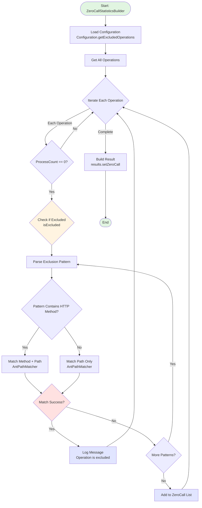
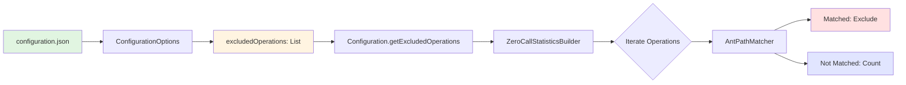
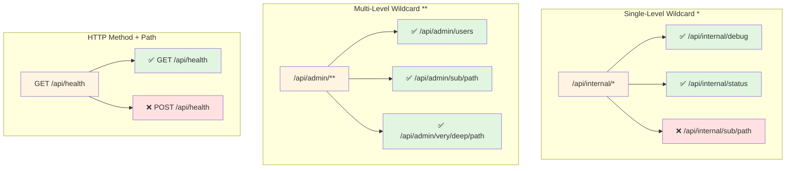
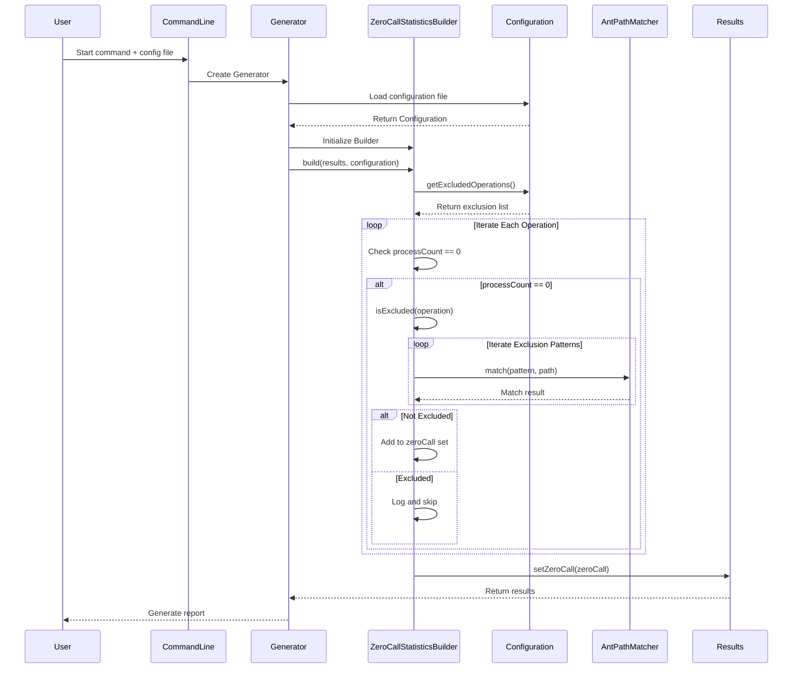

# Exclude API Feature Flowcharts

## Updated Empty Coverage Statistics Flow



## Configuration File to Code Flow



## Matching Pattern Examples



## Complete Data Flow



## Configuration Examples

### Minimal Configuration

```json
{
  "excludedOperations": ["GET /api/health"]
}
```

### Complete Configuration

```json
{
  "excludedOperations": [
    "/api/internal/*",
    "GET /api/health",
    "GET /api/metrics",
    "/api/admin/**",
    "POST /api/debug/*",
    "/actuator/**"
  ],
  "rules": {
    "status": {
      "filter": ["200"]
    }
  },
  "writers": {
    "html": {
      "filename": "swagger-coverage-report.html"
    }
  }
}
```

## Key Code Snippets

### isExcluded Method Logic

```java
private boolean isExcluded(OperationKey operation) {
    if (excludedOperations == null || excludedOperations.isEmpty()) {
        return false;  // No exclusion rules
    }

    String operationPath = operation.getPath();
    String operationMethod = operation.getHttpMethod().name();

    for (String excluded : excludedOperations) {
        String[] parts = excluded.trim().split("\\s+", 2);

        if (parts.length == 2) {
            // Format: "GET /api/users/*"
            String method = parts[0].toUpperCase();
            String path = parts[1];

            if (method.equals(operationMethod) &&
                pathMatcher.match(path, operationPath)) {
                return true;  // Match successful, exclude
            }
        } else {
            // Format: "/api/users/*" (all methods)
            if (pathMatcher.match(parts[0], operationPath)) {
                return true;  // Match successful, exclude
            }
        }
    }

    return false;  // No exclusion rule matched
}
```

## Use Cases

### Use Case 1: Exclude Health Check Endpoints

```json
{
  "excludedOperations": [
    "GET /health",
    "GET /actuator/health",
    "GET /api/health"
  ]
}
```

### Use Case 2: Exclude Internal APIs

```json
{
  "excludedOperations": ["/internal/**", "/api/internal/**", "/admin/**"]
}
```

### Use Case 3: Exclude Specific Operations

```json
{
  "excludedOperations": [
    "GET /api/metrics",
    "POST /api/debug/reset",
    "DELETE /api/cache"
  ]
}
```

### Use Case 4: Mixed Usage

```json
{
  "excludedOperations": [
    "GET /health",
    "/internal/**",
    "POST /api/test/*",
    "/actuator/**"
  ]
}
```
