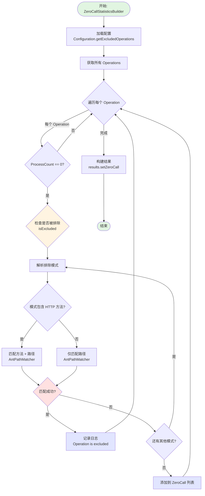
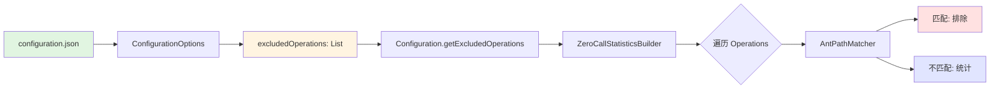
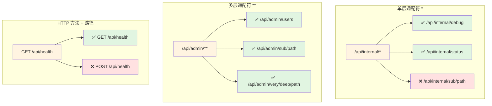
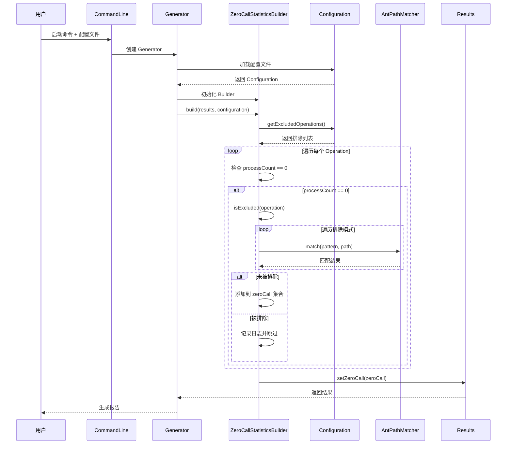

# 排除 API 功能流程图

## 更新后的 Empty Coverage 统计流程



## 配置文件到代码流程



## 匹配模式示例



## 完整的数据流



## 配置示例

### 最小配置
```json
{
  "excludedOperations": [
    "GET /api/health"
  ]
}
```

### 完整配置
```json
{
  "excludedOperations": [
    "/api/internal/*",
    "GET /api/health",
    "GET /api/metrics",
    "/api/admin/**",
    "POST /api/debug/*",
    "/actuator/**"
  ],
  "rules": {
    "status": {
      "filter": ["200"]
    }
  },
  "writers": {
    "html": {
      "filename": "swagger-coverage-report.html"
    }
  }
}
```

## 关键代码片段

### isExcluded 方法逻辑

```java
private boolean isExcluded(OperationKey operation) {
    if (excludedOperations == null || excludedOperations.isEmpty()) {
        return false;  // 没有排除规则
    }

    String operationPath = operation.getPath();
    String operationMethod = operation.getHttpMethod().name();

    for (String excluded : excludedOperations) {
        String[] parts = excluded.trim().split("\\s+", 2);
        
        if (parts.length == 2) {
            // 格式: "GET /api/users/*"
            String method = parts[0].toUpperCase();
            String path = parts[1];
            
            if (method.equals(operationMethod) && 
                pathMatcher.match(path, operationPath)) {
                return true;  // 匹配成功，排除
            }
        } else {
            // 格式: "/api/users/*" (所有方法)
            if (pathMatcher.match(parts[0], operationPath)) {
                return true;  // 匹配成功，排除
            }
        }
    }
    
    return false;  // 未匹配任何排除规则
}
```

## 使用场景

### 场景 1：排除健康检查端点
```json
{
  "excludedOperations": [
    "GET /health",
    "GET /actuator/health",
    "GET /api/health"
  ]
}
```

### 场景 2：排除内部 API
```json
{
  "excludedOperations": [
    "/internal/**",
    "/api/internal/**",
    "/admin/**"
  ]
}
```

### 场景 3：排除特定操作
```json
{
  "excludedOperations": [
    "GET /api/metrics",
    "POST /api/debug/reset",
    "DELETE /api/cache"
  ]
}
```

### 场景 4：混合使用
```json
{
  "excludedOperations": [
    "GET /health",
    "/internal/**",
    "POST /api/test/*",
    "/actuator/**"
  ]
}
```
